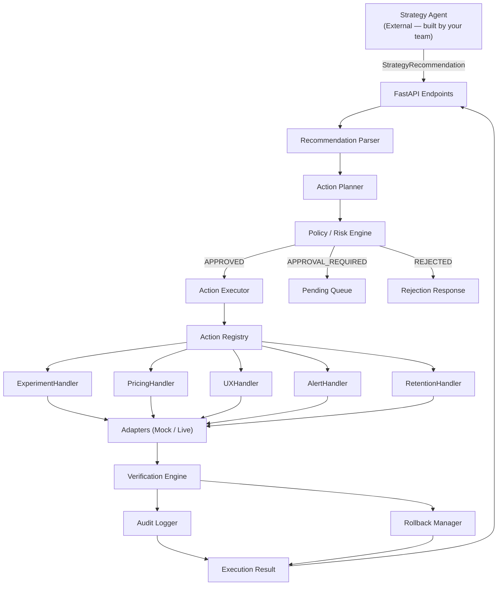

# Action Agent — Implementation Plan

## Repository Assessment

The workspace at `d:\Action agent` is **empty** — no existing repository, git history, framework, or agent code. This means:

- **No existing schemas** to reuse or conflict with
- **No existing Strategy Agent interface** to integrate against
- **No framework constraints** (LangGraph, LangChain, etc.) imposed by prior work

The Action Agent will be built as a **self-contained Python module** with clean, typed interfaces at its boundaries so the other four agents (built by your teammates) can integrate seamlessly later.

---

## Architecture Overview



---

## Technology Decisions

| Decision | Choice | Rationale |
|----------|--------|-----------|
| Language | Python 3.11+ | Team consistency, typing support |
| Web Framework | **FastAPI** | Async, typed schemas via Pydantic, auto-generated OpenAPI docs |
| Data Models | **Pydantic v2** | Validation, serialization, typed contracts |
| Persistence | **SQLite** (via `aiosqlite`) | Zero-setup, file-based — swappable to PostgreSQL later |
| Testing | **pytest** + **pytest-asyncio** | Standard, async-friendly |
| Config | **pydantic-settings** + `.env` | Typed config, 12-factor compliant |
| LLM Usage | **None** | All operations are deterministic — no LLM needed |

> [!IMPORTANT]
> **No LLM is used anywhere.** Every operation (validation, risk assessment, execution, verification) is deterministic code. This is intentional — the Action Agent's job is to execute reliably, not to reason probabilistically.

---

## Proposed Module Structure

```
d:\Action agent\
├── README.md
├── pyproject.toml
├── .env.example
├── .gitignore
│
├── action_agent/
│   ├── __init__.py
│   ├── main.py                          # FastAPI app entry point
│   ├── config.py                        # Settings & environment config
│   │
│   ├── schemas/                         # Pydantic data models (THE CONTRACT)
│   │   ├── __init__.py
│   │   ├── recommendation.py            # StrategyRecommendation input schema
│   │   ├── action.py                    # ActionPlan, ExecutionResult schemas
│   │   ├── policy.py                    # PolicyDecision, RiskLevel enums
│   │   └── audit.py                     # AuditEntry schema
│   │
│   ├── core/                            # Core business logic
│   │   ├── __init__.py
│   │   ├── parser.py                    # Recommendation → ActionPlan
│   │   ├── planner.py                   # Action planning & classification
│   │   ├── policy_engine.py             # Risk assessment & policy rules
│   │   ├── executor.py                  # Orchestrates execution pipeline
│   │   ├── verification.py              # Post-execution verification
│   │   ├── rollback_manager.py          # Rollback orchestration
│   │   └── idempotency.py               # Duplicate detection
│   │
│   ├── registry/                        # Action type registry + handlers
│   │   ├── __init__.py
│   │   ├── base.py                      # Abstract ActionHandler interface
│   │   ├── registry.py                  # ActionRegistry (type → handler map)
│   │   ├── experiment_handler.py        # EXPERIMENT actions
│   │   ├── pricing_handler.py           # PRICING_CHANGE actions
│   │   ├── ux_handler.py                # UX_UPDATE actions
│   │   ├── alert_handler.py             # ALERT actions
│   │   └── retention_handler.py         # RETENTION_INTERVENTION actions
│   │
│   ├── adapters/                        # External system abstraction
│   │   ├── __init__.py
│   │   ├── base.py                      # Abstract adapter interfaces
│   │   ├── feature_flag_adapter.py      # Feature flag service (LaunchDarkly, etc.)
│   │   ├── pricing_adapter.py           # Pricing service (Stripe, etc.)
│   │   ├── experiment_adapter.py        # Experimentation platform
│   │   ├── notification_adapter.py      # Email / Slack / PagerDuty
│   │   └── mock/                        # Mock implementations for demo
│   │       ├── __init__.py
│   │       ├── mock_feature_flag.py
│   │       ├── mock_pricing.py
│   │       ├── mock_experiment.py
│   │       └── mock_notification.py
│   │
│   ├── persistence/                     # Audit log & state storage
│   │   ├── __init__.py
│   │   ├── database.py                  # SQLite connection & schema
│   │   ├── audit_repository.py          # Audit CRUD
│   │   └── action_repository.py         # Action state CRUD
│   │
│   └── api/                             # FastAPI routes
│       ├── __init__.py
│       └── routes.py                    # All endpoints
│
├── tests/
│   ├── __init__.py
│   ├── conftest.py                      # Shared fixtures
│   ├── test_parser.py
│   ├── test_planner.py
│   ├── test_policy_engine.py
│   ├── test_executor.py
│   ├── test_verification.py
│   ├── test_rollback.py
│   ├── test_idempotency.py
│   ├── test_handlers.py
│   ├── test_adapters.py
│   ├── test_api.py
│   └── test_e2e_demo.py                # Full end-to-end demo scenario
│
└── demo/
    ├── demo_payloads.py                 # Example Strategy Agent payloads
    └── run_demo.py                      # CLI script to run the demo scenario
```

**Total: ~35 files**, cleanly separated by responsibility.

---

## Detailed Component Design

### 1. Strategy → Action Contract (`schemas/recommendation.py`)

This is the **single most important integration piece**. It defines what the Strategy Agent sends and what the Action Agent returns.

```python
# Input from Strategy Agent
class StrategyRecommendation(BaseModel):
    recommendation_id: str
    customer_segment: str
    priority: Priority          # LOW | MEDIUM | HIGH | CRITICAL
    confidence: float           # 0.0 – 1.0
    reason: str
    recommended_action: RecommendedAction
    expected_impact: ExpectedImpact
    constraints: ActionConstraints
    timestamp: datetime
    expires_at: datetime | None = None

# Output from Action Agent
class ExecutionResult(BaseModel):
    action_id: str
    recommendation_id: str
    action_type: ActionType
    execution_status: ExecutionStatus
    verification_status: VerificationStatus
    execution_mode: ExecutionMode     # DRY_RUN | LIVE
    risk_level: RiskLevel
    policy_decision: PolicyDecision
    rollback_supported: bool
    rollback_id: str | None
    details: dict
    timestamp: datetime
```

> [!IMPORTANT]
> **Integration Point for Your Team:** When the Strategy Agent is built, it must produce a `StrategyRecommendation` JSON payload. The Action Agent validates it via Pydantic — any missing or invalid fields are rejected with structured errors. Your teammates can import these schemas directly or serialize to JSON over HTTP.

---

### 2. Action Types & Registry (`registry/`)

```python
class ActionType(str, Enum):
    EXPERIMENT = "EXPERIMENT"
    PRICING_CHANGE = "PRICING_CHANGE"
    UX_UPDATE = "UX_UPDATE"
    ALERT = "ALERT"
    RETENTION_INTERVENTION = "RETENTION_INTERVENTION"
```

The `ActionRegistry` maps each `ActionType` to a handler class. Adding new action types requires:
1. Define a new `ActionType` enum value
2. Write a handler implementing `ActionHandler` ABC
3. Register it: `registry.register(ActionType.NEW_TYPE, NewHandler())`

No existing code changes needed — **open/closed principle**.

---

### 3. Policy / Risk Engine (`core/policy_engine.py`)

Configurable rules, not hardcoded logic:

| Rule | LOW Risk | MEDIUM Risk | HIGH Risk |
|------|----------|-------------|-----------|
| Min confidence | 0.5 | 0.7 | 0.85 |
| Max rollout % | 100% | 50% | 20% |
| Requires approval | No | No | **Yes** |
| Auto-execute in DRY_RUN | Yes | Yes | Yes |
| Auto-execute in LIVE | Yes | Yes | **No** |

Risk classification:

| Action Characteristics | Risk Level |
|----------------------|------------|
| Internal alert, analytics event | LOW |
| Small experiment (≤20%), feature flag toggle | LOW |
| Customer-facing campaign, rollout 20-50% | MEDIUM |
| Pricing change, large rollout (>50%), irreversible | HIGH |

These thresholds are loaded from `config.py` / environment variables, **not hardcoded**.

---

### 4. Execution Adapters (`adapters/`)

Every external system interaction goes through an adapter interface:

```python
class FeatureFlagAdapter(ABC):
    async def enable_flag(self, flag_key: str, segment: str, rollout_pct: float) -> AdapterResult
    async def disable_flag(self, flag_key: str, segment: str) -> AdapterResult
    async def get_flag_state(self, flag_key: str) -> dict
```

**Mock adapters** simulate realistic behavior:
- Return success/failure responses
- Maintain in-memory state (so verification can check it)
- Simulate latency
- Support rollback by storing previous state

**Live adapters** are left as interfaces — your team plugs in real LaunchDarkly, Stripe, SendGrid, etc. later.

---

### 5. Execution Modes

| Mode | Behavior |
|------|----------|
| `DRY_RUN` | Full pipeline executes but adapters simulate. No real external changes. Audit logs are still written (tagged as dry-run). |
| `LIVE` | Adapters call real external systems. HIGH risk actions require approval. |

Default: `DRY_RUN` (safe for demo).

---

### 6. Idempotency (`core/idempotency.py`)

- Fingerprint = `hash(recommendation_id + action_type + sorted(parameters))`
- Before execution: check if fingerprint exists in action store
- If exists: return cached `ExecutionResult` with `status=ALREADY_EXECUTED`
- If not: proceed with execution, store fingerprint on completion

---

### 7. Rollback (`core/rollback_manager.py`)

- Each handler declares `rollback_supported: bool`
- On execution, adapters store `pre_action_state` (e.g., feature flag was `OFF`)
- Rollback reverses to `pre_action_state`
- Non-reversible actions (e.g., sent notifications) are marked `rollback_supported=False`
- Rollback creates its own audit entry

---

### 8. Audit Logging (`persistence/audit_repository.py`)

Every action records a complete `AuditEntry` to SQLite:

```
action_id | recommendation_id | timestamp | action_type | target |
parameters | risk_level | confidence | policy_decision | approval_status |
execution_mode | execution_status | verification_status | rollback_status |
error_info | result_details
```

Queryable via API endpoints (`GET /actions/history`).

---

### 9. API Endpoints (`api/routes.py`)

| Method | Endpoint | Purpose |
|--------|----------|---------|
| `POST` | `/actions/execute` | Execute a strategy recommendation |
| `POST` | `/actions/preview` | Preview what would happen (no execution) |
| `GET` | `/actions/{action_id}` | Get action details & status |
| `POST` | `/actions/{action_id}/rollback` | Rollback a completed action |
| `GET` | `/actions/history` | Query audit log with filters |
| `POST` | `/actions/{action_id}/approve` | Approve a pending high-risk action |
| `GET` | `/health` | Health check |

---

### 10. Testing Strategy

| Test File | Covers | Count |
|-----------|--------|-------|
| `test_parser.py` | Valid/invalid recommendation parsing | ~5 |
| `test_planner.py` | Action classification, plan generation | ~5 |
| `test_policy_engine.py` | Risk assessment, confidence checks, policy rules | ~8 |
| `test_executor.py` | Full pipeline, dry-run, live, adapter failures | ~6 |
| `test_verification.py` | Verification pass/fail scenarios | ~4 |
| `test_rollback.py` | Rollback supported/unsupported, rollback execution | ~4 |
| `test_idempotency.py` | Duplicate detection, fingerprinting | ~4 |
| `test_handlers.py` | Each handler type execution | ~5 |
| `test_adapters.py` | Mock adapter state management | ~4 |
| `test_api.py` | HTTP endpoint integration tests | ~8 |
| `test_e2e_demo.py` | Full demo scenario end-to-end | ~3 |
| **Total** | | **~56 tests** |

---

### 11. Demo Scenario

The demo script (`demo/run_demo.py`) will execute this exact flow:

```
INPUT: Strategy Agent says "High-risk customer segment, churn prob 0.84, 
       start 20% onboarding experiment"

 1. Parse recommendation          → StrategyRecommendation object
 2. Classify action               → ActionType.UX_UPDATE
 3. Assess risk                   → RiskLevel.LOW (20% rollout, conf 0.91)
 4. Check policy                  → PolicyDecision.APPROVED
 5. Check idempotency             → Not previously executed
 6. Generate execution plan       → ActionPlan with all parameters
 7. Execute via MockFeatureFlag   → Adapter simulates flag enable
 8. Verify execution              → VerificationStatus.PASSED
 9. Write audit log               → SQLite entry created
10. Return ExecutionResult        → SUCCESS with rollback info

OUTPUT: Structured JSON showing every step's decision
```

Runnable with: `python -m demo.run_demo`

---

## Open Questions

> [!IMPORTANT]
> **Q1: Inter-Agent Communication Protocol**
> How will the Strategy Agent call the Action Agent in the final system? Options:
> - **HTTP/REST** (Action Agent runs as a microservice — my default assumption)
> - **Direct Python import** (all agents in one process)
> - **Message queue** (Kafka, RabbitMQ, Redis Streams)
> 
> I will build the REST API as the primary interface, with the core logic callable as a Python function too (so both options work).

> [!IMPORTANT]
> **Q2: Database Choice**
> I'll use **SQLite** for zero-setup (perfect for demo). The persistence layer is behind a repository interface, so swapping to PostgreSQL/MySQL later is a single-file change. Acceptable?

> [!IMPORTANT]
> **Q3: Frontend Dashboard**
> Your spec mentions exposing Action Agent data to a frontend. Since no frontend exists yet, I'll create the **API endpoints** that a future dashboard can consume, but won't build a UI. Should I add a minimal HTML dashboard page instead?

---

## Verification Plan

### Automated Tests
```bash
# Run all tests
pytest tests/ -v --tb=short

# Run with coverage
pytest tests/ -v --cov=action_agent --cov-report=term-missing
```

### Manual Verification
```bash
# Start the server
uvicorn action_agent.main:app --reload

# Run the demo scenario
python -m demo.run_demo

# Test via API
curl -X POST http://localhost:8000/actions/preview -H "Content-Type: application/json" -d @demo/sample_payload.json
```

---

## Assumptions & Integration Points for Your Team

| # | Assumption | Impact | Action Required |
|---|-----------|--------|-----------------|
| 1 | Strategy Agent will produce `StrategyRecommendation` JSON | Contract defined in `schemas/recommendation.py` | Your team imports or matches this schema |
| 2 | No existing database or ORM | Using SQLite + raw async SQL | Swap adapter if team has a shared DB |
| 3 | No existing auth/permissions system | Approval is state-based, not user-based | Add auth middleware when identity system exists |
| 4 | External services (LaunchDarkly, Stripe, etc.) are not available | Mock adapters used | Replace mocks with live adapter implementations |
| 5 | All agents run independently | Action Agent is a standalone FastAPI service | Adjust if team wants a monolith |
